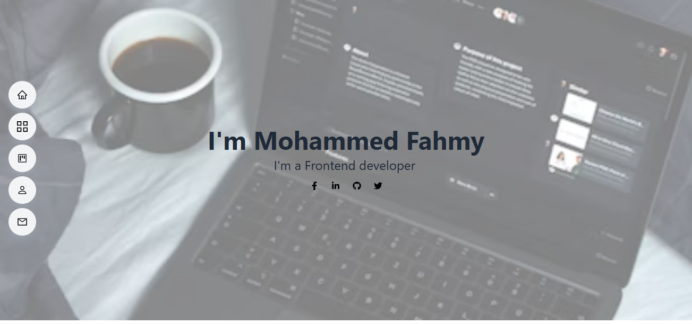
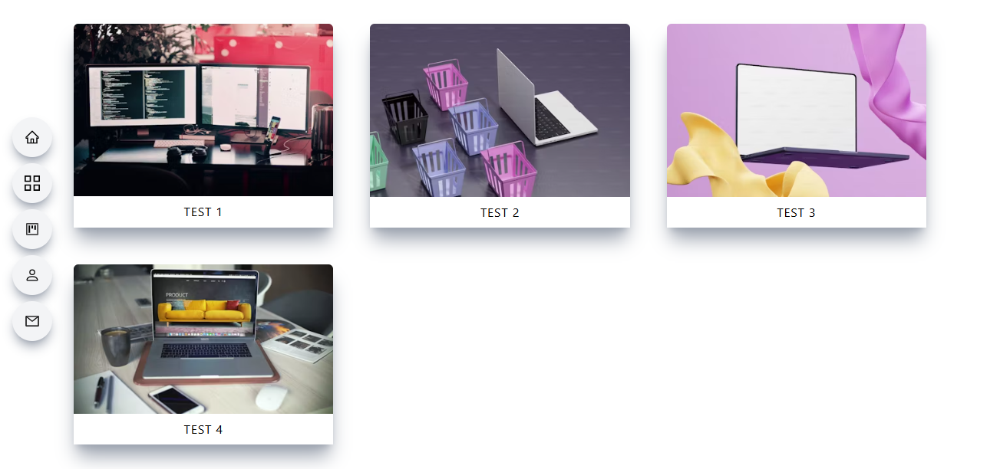
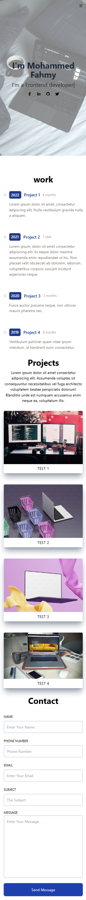

# Portfolio Website

Welcome to my portfolio website! This site showcases my work and projects as a frontend developer.





## Features

- **Home Section**: Introduces myself with a professional background image and links to my social media profiles.
- **Work Section**: Lists my previous projects with brief descriptions and the duration of each project.
- **Projects Section**: Displays images of my projects with placeholder titles for demonstration.
- **Contact Section**: A contact form for visitors to reach out to me.

## Technologies Used

- **HTML5**: For the structure of the web pages.
- **CSS3**: For styling and layout.
- **JavaScript**: For interactive elements.
- **React**: For building user interfaces.
- **TypeScript**: For type safety and enhanced development experience.

## How to Run

1. Clone the repository:

   ```bash
   git clone https://github.com/yourusername/your-repo-name.git
   
